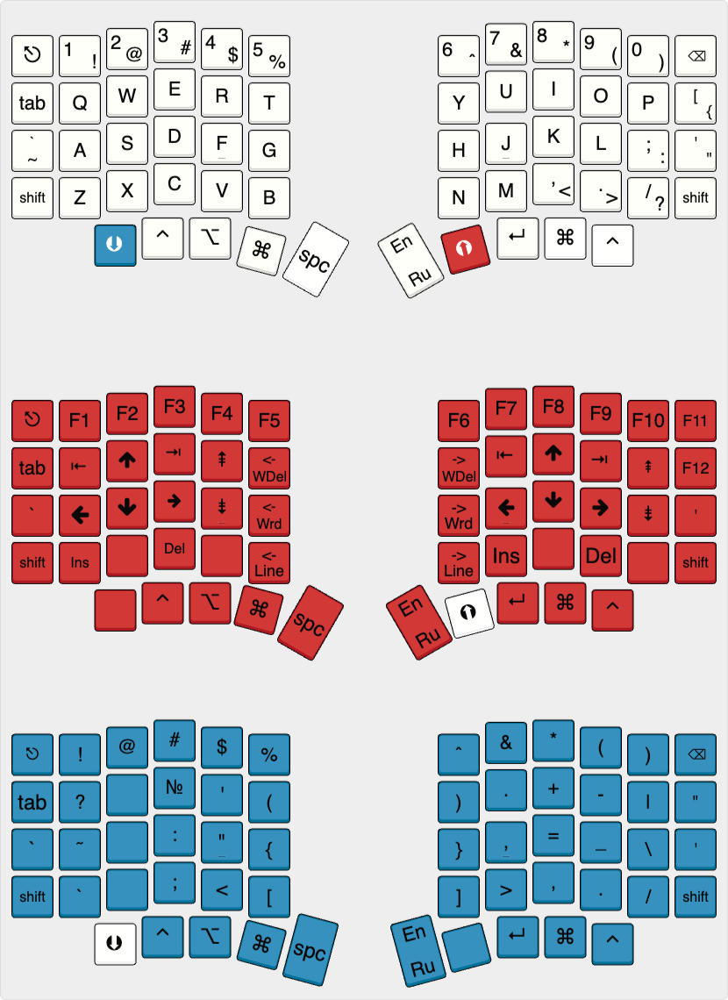
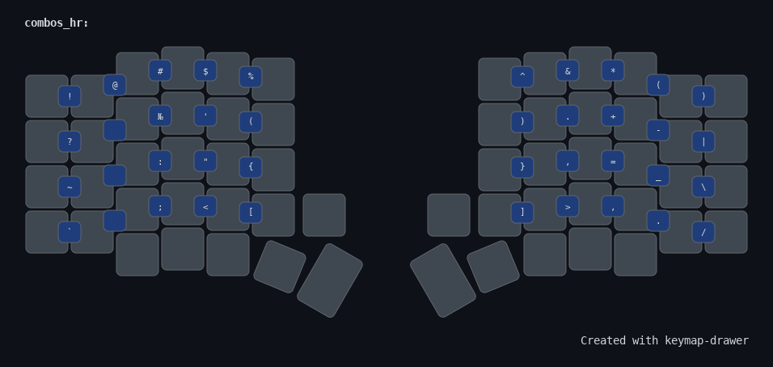
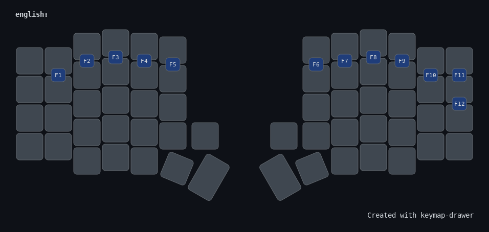

[](https://zmk.dev)
[](https://github.com/josefadamcik/SofleKeyboard)

# Sofle Custom RUS — прошивка для ZMK с независимым от раскладки ОС расположением символов

Прошивка предназначена для эргономичной split-клавиатуры Sofle RGB v2 (MX) 
на контроллерах NRF52840.  
Основная задача — обеспечить независимый от раскладки ОС ввод и удобную работу с английским и русским языками.  
Поддерживается автоматическое переключение
раскладки в ОС, эффективный ввод специальных символов через комбо, залипающие шифты.  
RGB-подсветка и OLED-дисплей не поддерживаются из-за сильного уменьшения времени автономной работы при их включении. В планах есть попробовать LCD дисплеи.  

Данная прошивка для **беспроводной** клавиатуты с поддержкой `ZMK`.  
**Для проводной версии клавиатуры (`QMK`)** находится тут - [sofle-custom-rus](https://github.com/konst2/sofle-custom-rus)

## Требования к железу

Платы: Sofle RGB v2 беспроводная версия.  
Контроллеры: NRF52840  
Дополнительно:  
2× энкодера  


Инструкция по сборке: [PandaKB Sofle Build Guide](https://pandakb.com/guides/sofle-rgb-mx-build-guide/)  
Плата для которой собрана прошивка была куплена в магазине `MiFuny`  

**Не распаяны** ради экономии батареи и увеличения времени автономной работы:  
- OLED-дисплеи  
- RGB-светодиоды  
- резисторы определения стороны клавиатуры  
- микросхемы USBLC6-2SC6  

## Возможности прошивки

### Умное переключение раскладки (плагин [zmk-lang-agnostic-behaviors](https://github.com/konst2/zmk-lang-agnostic-behaviors) + Karabiner / AutoHotkey)

Прошивка использует плагин [zmk-lang-agnostic-behaviors](https://github.com/konst2/zmk-lang-agnostic-behaviors) который добавляет behaviors для управления раскладками.

#### Принцип работы

При необходимости переключения языка по клавише переключения раскладки или ввода символа который находится в неактивной раскладке, прошивка автоматически отправляет `F18` или `F17`, которые ОС интерпретируют как команду смены раскладки. Клавиши разные для каждого языка, что
решает проблему оригинального плагина рассинхронизации между клавиатурой и ОС которая будет возникать при использовании только одной клавиши для переключения раскладки. Теперь же, текущий язык клавиатуры практически всегда совпадает с системным.

#### Настройка OS

- MacOS  
Установите [Karabiner-Elements](https://github.com/pqrs-org/Karabiner-Elements).  
Далее надо добавить 2 правила через  
Settings -> Complex Modification -> Add Your Own Rule:  
 1.  
```json
{
    "description": "F17 -> переключить на английский (даже с Shift/Ctrl и др.)",
    "manipulators": [
        {
            "from": {
                "key_code": "f17",
                "modifiers": { "optional": ["any"] }
            },
            "to": [{ "select_input_source": { "language": "en" } }],
            "type": "basic"
        }
    ]
}
```

 2.  
```json
{
    "description": "F18 -> переключить на русский (даже с Shift/Ctrl и др.)",
    "manipulators": [
        {
            "from": {
                "key_code": "f18",
                "modifiers": { "optional": ["any"] }
            },
            "to": [{ "select_input_source": { "language": "ru" } }],
            "type": "basic"
        }
    ]
}
```
>Для русского языка в macOS следует обязательно заменить раскладку на "Русский — PC", (вместо "Русский" установленный в системе по умолчанию). 

> Как английскую раскладку в MacOS рекомендуется `США`. При использовании `США-международная` возникает проблема с комбинацией некоторых символов.

- Windows 11.  
Установить утилиту [Autohotkey V2](https://www.autohotkey.com/)  
В папке автозапуска Windows следует создать файл `lang_shift.ahk` в котором:  
```
; Переключение на английский по F17 (игнорируя модификаторы)
*$F17::{
    SetInputLang("00000409") ; en-US w11
}

; Переключение на русский по F18 (игнорируя модификаторы)
*$F18::{
    SetInputLang("00000419") ; ru-RU w11
}

; Функция установки раскладки (для AHK v2)
SetInputLang(LocaleID) {
    hWnd := WinGetID("A") ; активное окно
    threadID := DllCall("GetWindowThreadProcessId", "Ptr", hWnd, "Ptr", 0, "UInt")
    hkl := DllCall("LoadKeyboardLayout", "Str", LocaleID, "UInt", 1, "Ptr")
    if (!hkl)
        return
    ; Отправляем сообщение для смены раскладки в поток окна
    DllCall("PostMessage", "Ptr", -1, "UInt", 0x50, "Ptr", threadID, "Ptr", hkl)
}
```

>Тут `00000409` и `00000419` id русской и английской раскладок в системе.  Если вдруг возникнут проблемы их можно посмотреть в `PowerShell`  
```
Get-WinUserLanguageList | ForEach-Object {
    Write-Host "Язык: $($_.LanguageTag)"
    $_.InputMethodTips | ForEach-Object { Write-Host "  Раскладка: $_" }
}
```

- Linux.  
Аналогично, перехват F18/F17.  
F18 - переключение на русскую раскладку.  
F17 - переключение на английскую раскладку

### Раскладка слоёв.  

[Keyboard Layout Editor](https://www.keyboard-layout-editor.com/#/gists/26ca3f92825312924ce738406f96e0a4)



`Красный слой` `RAISE` -- навигация.  
`Синий слой` `LOWER`-- знаки. Однако гораздо удобнее пользоваться комбо (см ниже) на которых сейчас все эти знаки есть, поэтому клавиша синего слоя перенесена подальше от большого пальца.  

>TODO: ADJUST layer


## Комбо

Комбо активируются при одновременном (или почти одновременном) нажатии соседних клавиш.  


Горизонтальные комбо повторяют символьный слой — то есть спецсимволы, скобки, знаки препинания:  



---

Вертикальные комбо (соседние клавиши по вертикали) отдают соответсвующую Fx клавишу.  



Преимущества:  
- Не нужно переключаться на дополнительный слой — символ вводится одним движением;
- Идеально для программистов: !@#$%^&*() и другие символы доступны без модификаторов.
- Комбо работают в обеих раскладках (EN/RU)


## TriLayer

При одновременной активации слоев LOWER и RAISE автоматически активируется слой ADJUST для системных настроек.


## Залипающий Shift

Оба Shift работают так:  
- если Shift зажат как обычно, и во время его зажатия были введены какие-либо символы, то считаем, что это обычный Shift.  
- если Shift был однократно нажат, то он срабатывает к одной следующей клавише. Бывает удобно нажать перед заглавной буквой, если она одна. 


## Перемещение по словам и удаление по словам

В навигационном слое `RAIZE`:  

| Клавиша | Описание |
|---------|----------|
| `T`     | Удалить слово до курсора |
| `Y`     | Удалить слово после курсора |
| `G`     | На слово назад |
| `H`     | На слово вперёд |
| `B`     | В начало строки |
| `N`     | В конец строки |

Команды адаптированы под macOS.  
Коды клавиш под все ОС определены в файле `config/definitions/navigations.dtsi`  
Для их изменения под нужную ОС, следует опрделить нужные комбинации в файле раскладки `config/sofle.keymap` для слоя `RAIZE`

## Включение/выключение слоя навигации

Нажатие на правый энкодер включает или выключает слой навигации `RAIZE`


## Энкодеры
Левый энкодер: 
- регулировка громкости (VOLU/VOLD).  
- нажатие - MUTE.  
  
Правый энкодер: 
- изменение яркости экрана (клавиши по умолчанию для MqcOS) (F14/F15).  
- нажатие - включение слоя навигации.  


## Сборка и прошивка

>Уже скомпилированная прошивка для контроллера NRF52840 в файлах:  
`_builds/sofle_left.uf2` для левой половины клавиатуры  
`_builds/sofle_right.uf2` для правой половины клавиатуры  


Для разработки использована версия ZMK 0.3.0  

>TODO: Описание компиляции прошивки самостоятельно через github actions и docker локально

Прошиваются обе половины клавиатуры. Каждая половина своей прошивкой.  
на стандартной плате контроллер переводится в режим прошивки при быстром нажатии два раза кнопки `reset` на клавиатуре.


# Ссылки

>TODO:
